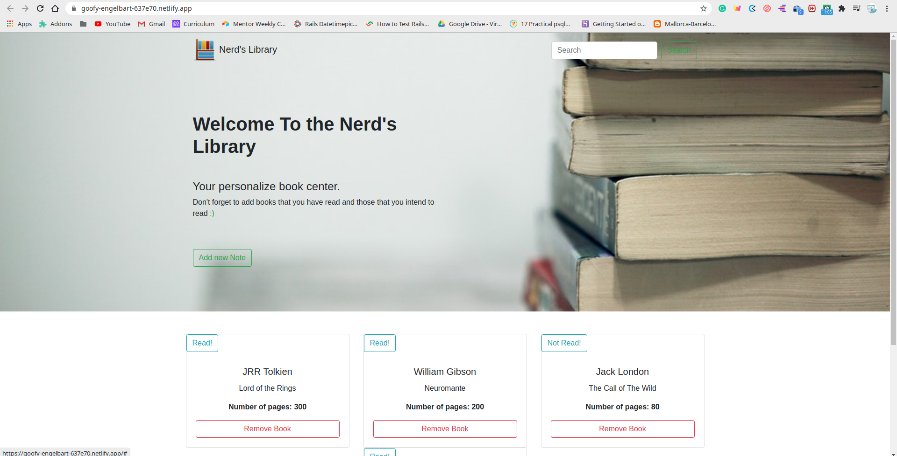

<!--
*** Thanks for checking out this README Template. If you have a suggestion that would
*** make this better, please fork the repo and create a pull request or simply open
*** an issue with the tag "enhancement".
*** Thanks again! Now go create something AMAZING! :D
-->

<!-- PROJECT SHIELDS -->
<!--
*** I'm using markdown "reference style" links for readability.
*** Reference links are enclosed in brackets [ ] instead of parentheses ( ).
*** See the bottom of this document for the declaration of the reference variables
*** for contributors-url, forks-url, etc. This is an optional, concise syntax you may use.
*** https://www.markdownguide.org/basic-syntax/#reference-style-links
-->

 

# Js Library

> In this project, we built an online library. 
Users can: 
- See list of Books
- Delete books from the library.
- Add books to the library.
- Toggle the read status of the books in the library.
- Uses localStorage to store data.

#  Screenshot

# Live Demo
[Live Demo Link](https://goofy-engelbart-637e70.netlify.app/)

# Built With

- JavaScript
- HTML5
- BOOTSTRAP
- CSS3

### Usage

- Click the Live Demo link and enjoy our website.

### Prerequisites

- A modern browser, up to date.

# Authors

## Author

👤 **Kelly Booster**

- Github: [@kelibst](https://github.com/kelibst)
- Twitter: [@keli_booster](https://twitter.com/keli_booster)
- Linkedin: [Kekeli (Jiresse) Dogbevi
](https://www.linkedin.com/in/kekeli-dogbevi-jiresse/)

👤 **Author2**
Aremu Lucky

- Github: [@githubhandle](https://github.com/Luckyaremu)
- Twitter: [@twitterhandle](@luckyaremu)
- Linkedin: [linkedin]()

# 🤝 Contributing
Contributions, issues and feature requests are welcome!

Feel free to check the issues page

# Show your support
Give a ⭐️ if you like this project!

This project is [MIT](lic.url) licensed.